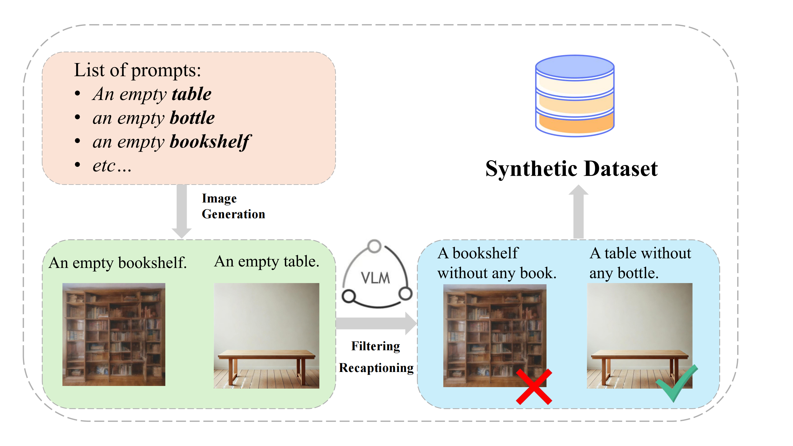

# Object State Representation Pipeline

## Introduction

This repository implements the fully automatic synthetic data generation and fine‑tuning pipeline introduced in _Improving Physical Object State Representation in Text‑to‑Image Generative Systems_. Starting from a curated set of object nouns, the pipeline:

1. **Generates template prompts** describing objects in empty or absent states.  
2. **Synthesizes images** with an off‑the‑shelf text‑to‑image model.  
3. **Filters out incorrect examples** using a vision‑language model to verify “empty‑state” accuracy.  
4. **Recaptions prompts** via LLMs for linguistic diversity.  
5. **Fine‑tunes generative models** on the cleaned synthetic dataset to improve physical state representation.

---

## Pipeline Illustration

 

---

## Installation

Install core dependencies with `pip` (requires Python 3.8+):

```bash
# 1. (Optional) Create & activate a virtual environment
python3 -m venv .venv
source .venv/bin/activate

# 2. Install required packages
pip install \
  torch torchvision \
  diffusers transformers \
  openai \
  pillow tqdm
```

## Usage

```bash
# Clone the repo and run the pipeline script
git clone https://github.com/your-org/object-state-pipeline.git
cd object-state-pipeline
```
### 1. Dry‑run prompt & image generation
```bash
# Generate the first 5 prompts and their images, then exit:
python pipeline.py \
  --api_key YOUR_OPENAI_KEY \
```
### 2. Full pipeline with filtering & recaptioning
```bash
python pipeline.py \ 
  --experiment_folder experiments/v1 \ 
  --api_key YOUR_OPENAI_KEY \ 
  --prompt_generator ObjectBasedPromptGenerator \ 
  --image_generator StableDiffusionImageGenerator \ 
  --lora /path/to/lora_weights.safetensors \ 
  --image_filter GPT4VImageFilter \ 
  --image_recaptioner GPT4VImageRecaptioner \ 
  --num_images_per_prompt 7
```
### 3. Skip recaptioning (use original prompts)
```bash
python run_pipeline.py \
  --api_key YOUR_OPENAI_KEY \
  --no_processing
```
## Datasets

All benchmark prompt‑lists live in the `datasets/` folder as JSON files. Each file contains a flat list of prompt strings.

- **`object_state_bench.json`**  
  - **Size:** 200 prompts (100 machine‑generated + 100 human‑curated)  
  - **Purpose:** Evaluates object absence/empty states on common household items  
  - **Hugging Face:** [Tianle/Object‑State‑Bench](https://huggingface.co/datasets/Tianle/Object-State-Bench)  

- **`genai_object_state.json`**  
  - **Size:** 214 prompts (filtered “negation” subset from GenAI‑Bench)  
  - **Purpose:** Tests generation of objects in varied physical states drawn from a public negation benchmark  
  - **Hugging Face:** [Tianle/Object‑State‑Bench](https://huggingface.co/datasets/Tianle/Object-State-Bench)  

You can load them directly via 🤗 Datasets:

---

## Paper

This repository implements the pipeline described in our paper _Improving Physical Object State Representation in Text‑to‑Image Generative Systems_.  
A preprint will be available on arXiv soon.


